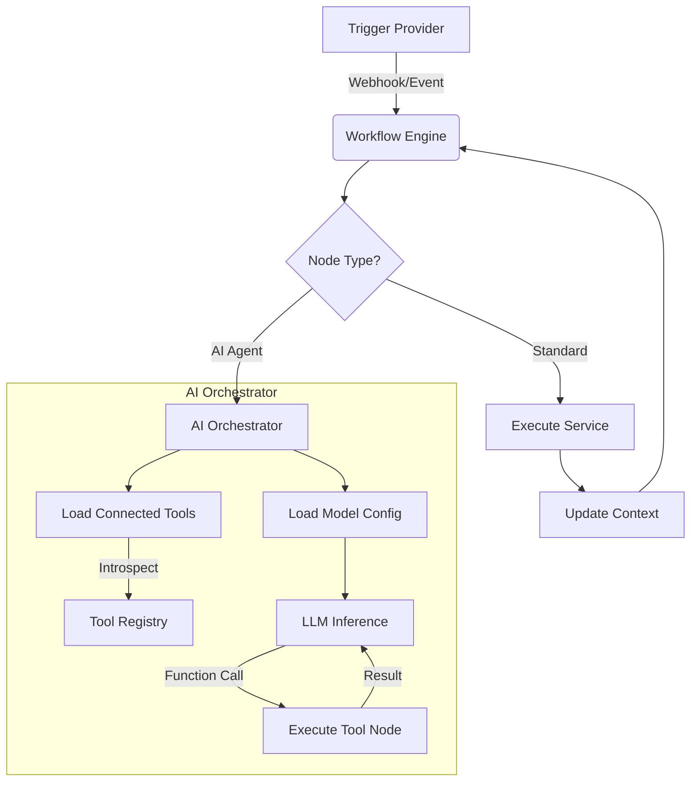

# 🏗️ High-Level System Design: Enterprise Automation & AI Agents

## 1. Executive Summary
This document outlines the architecture for the **Aerostic Advanced Automation Engine**, a highly scalable, n8n-style iPaaS embedded within the Aerostic platform. It enables visual workflow orchestration with a focus on "AI as a Brain," allowing LLMs to autonomously utilize connected nodes (Google Drive, Email, API) as executable tools.

## 2. System Architecture

### 2.1 Core Components
1.  **Visual Builder (Frontend)**: ReactFlow-based editor supporting complex topologies (DAGs), multi-type handles (Flow, Data, Tool, Model), and real-time validation.
2.  **Workflow Engine (Backend)**: NestJS service responsible for traversing the graph, managing execution context, and handling asynchronous operations.
3.  **Tool Registry**: A dynamic factory that converts standard nodes (e.g., `GoogleDriveNode`) into AI-executable definitions (Function Call Tools).
4.  **Security Layer**: Comprehensive validation and encryption boundary protecting external credentials and preventing abuse (e.g., SSRF).

### 2.2 Data Flow

## 3. Detailed Component Design

### 3.1 AI Agent "Brain" Architecture
Unlike traditional linear flows, the **AI Agent Node** acts as a dynamic router. It does not just pass data to the next node; it *consumes* connected nodes as capabilities.

-   **Model Inputs**: Dedicated handles to connect `OpenAIModelNode` or `GeminiModelNode` (defining auth & parameters).
-   **Tool Inputs**: Dedicated handles to connect `GoogleDriveNode`, `ApiNode`, `EmailNode`.
-   **Execution**:
    1.  Engine detects `AI Agent` execution.
    2.  Engine scans upstream "Tool" connections.
    3.  Engine *instantiates* the connected nodes but does not *run* them.
    4.  Instead, it converts them into **JSON Schema Tools** (e.g., `upload_file`, `send_email`).
    5.  LLM is invoked with these tools.
    6.  If LLM calls `send_email`, the Engine executes the connected `EmailNode` securely.

### 3.2 Security & Compliance

#### 🔒 Credential Management
-   **Encryption at Rest**: All API keys (OpenAI, Gmail, Stripe) stored in `Node.data` are encrypted using AES-256 before saving to the database.
-   **Decryption**: Keys are decrypted *only* at the moment of execution within the `WorkflowsService` memory scope.

#### 🛡️ Network Security (SSRF Protection)
The `ApiNode` allows users to make arbitrary HTTP requests. To prevent Server-Side Request Forgery (SSRF):
-   **Blocklist**: Deny requests to private IP ranges (`127.0.0.1`, `10.0.0.0/8`, `192.168.0.0/16`, `169.254.169.254` - AWS Metadata).
-   **DNS Resolution**: Resolve domains before connection to ensure they don't map to local addresses.
-   **Rate Limiting**: Strict limits on outbound requests per tenant.

#### 📝 Audit Logging
Every execution step is logged immutably:
-   **Input Data**: What data entered the node.
-   **Execution Status**: Success/Failure/Retries.
-   **Output Data**: Result passed to the next node.
-   **AI Thoughts**: The reasoning chain of the AI Agent (CoT).

## 4. Node Specifications

### 4.1 Data & Communication
-   **Contact Node**: specific CRUD operations for the internal CRM.
-   **Template Node**: Meta-approved WhatsApp template sender with variable mapping.
-   **Email Node**: SMTP sender supporting HTML content and attachments.

### 4.2 External Integration
-   **Webhook Node**: unique, persistent URL generator (`/hooks/<flow_id>/<node_id>`). Supports `GET`/`POST`, headers, and query params validation.
-   **Google Drive Node**: OAuth2-based file manager. Supports `upload`, `download`, `list`, `search`.
-   **API Node**: Generic HTTP client with Auth support (Bearer, Basic, Header).

### 4.3 AI & Logic
-   **AI Agent**: central cognitive engine.
-   **Model Nodes**: Configuration providers (OpenAI, Anthropic, Gemini).
-   **Memory Nodes**: Context injection (Conversation History, Vector DB).

## 5. Implementation Roadmap
1.  **Phase 21**: Core Node Implementation (Email, Template, Contact).
2.  **Phase 22**: External Integrations (Webhook, Drive, API).
3.  **Phase 23**: AI Brain Architecture (Tool Binding System).
4.  **Phase 24**: Security Hardening & SSRF Protection.
