# Aerostic System Architecture Diagrams

## 1. OAuth & Embedded Signup Flow (The "WATI" Way)

This flow demonstrates how a User connects their WhatsApp Business Account (WABA) to Aerostic without sharing their user credentials, using the System User Token approach.

```mermaid
sequenceDiagram
    participant User as 👤 User (Browser)
    participant Front as 🖥️ Frontend (Next.js)
    participant Back as ⚙️ Backend (NestJS)
    participant Meta as ♾️ Meta (Facebook)
    participant DB as 🗄️ Database

    Note over User, Meta: STEP 1: Initiation
    User->>Front: Clicks "Connect WhatsApp"
    Front->>Back: GET /whatsapp/embedded/start?tenantId=123
    Back->>Back: Generate Meta OAuth URL\n(scope=whatsapp_business_management, etc.)
    Back-->>Front: Return 302 Redirect URL
    Front->>User: Redirect to Facebook.com

    Note over User, Meta: STEP 2: Embedded Signup (Meta Hosted)
    User->>Meta: Login to Facebook
    User->>Meta: Select Business & WABA
    User->>Meta: "Grant Permissions to Aerostic"
    Meta-->>User: Redirect to Callback URL\n(code=AUTH_CODE, state=tenantId)

    Note over User, Back: STEP 3: Token Exchange (Server-Side)
    User->>Back: GET /meta/callback?code=...
    Back->>Meta: POST /oauth/access_token (System Exchange)
    Meta-->>Back: Return System Access Token (Long-lived)
    
    Note over Back, DB: STEP 4: Asset Discovery & Storage
    Back->>Meta: GET /me/businesses (with System Token)
    Back->>Meta: GET /owned_whatsapp_business_accounts
    Back->>Meta: GET /phone_numbers
    Back->>Back: Encrypt System Token
    Back->>DB: Save Mapping:\n(tenantId, wabaId, phoneId, encryptedToken)
    Back-->>Front: "Connected Successfully"
```



## 2. Message Dispatch Flow (Outbound)

How Aerostic sends messages on behalf of the tenant using the stored System Token. The Frontend NEVER talks to Meta directly.

```mermaid
sequenceDiagram
    participant Agent as 🕵️ Agent / AI
    participant API as 📨 Message Dispatcher (NestJS)
    participant DB as 🗄️ Database
    participant Meta as ☁️ Meta Cloud API
    participant Customer as 📱 Customer (WhatsApp)

    Agent->>API: POST /messages/send\n{tenantId, to, text}
    
    Note right of API: Security Check
    API->>DB: Lookup Tenant's PhoneID & System Token
    DB-->>API: Returns { phone_number_id, access_token } (Decrypted)
    
    Note right of API: Dispatch
    API->>Meta: POST /v18.0/{phone_id}/messages\n(Auth: Bearer SystemToken)
    Meta-->>API: 200 OK { message_id }
    
    API->>DB: Store Message (status=sent)
    Meta->>Customer: Delivers Message
```



## 3. Incoming Webhook & AI Automation Flow

How Aerostic handles incoming messages, routes them to the correct tenant, and triggers AI/Automation safely.

```mermaid
sequenceDiagram
    participant Customer as 📱 Customer
    participant Meta as ☁️ Meta Cloud API
    participant Webhook as 🪝 Webhook Handler (NestJS)
    participant Router as 🚦 Tenant Router
    participant AI as 🤖 AI Agent Service
    participant Dispatch as 📨 Message Dispatcher

    Customer->>Meta: Sends "Hello"
    Meta->>Webhook: POST /webhooks/meta\n(JSON payload)
    
    Note right of Webhook: Validation
    Webhook->>Webhook: Verify X-Hub-Signature
    
    Note right of Router: Routing
    Webhook->>Router: Extract phone_number_id
    Router->>Router: Find Tenant by phone_number_id
    
    Router->>DB: Save Incoming Message
    
    Note right of Router: Automation Trigger
    Router->>AI: analyzeMessage(tenantId, text)
    
    alt Confidence High (>70%)
        AI->>Dispatch: Send Auto-Reply
        Dispatch->>Meta: POST /messages/send
        Meta->>Customer: "Hi! How can I help?"
    else Confidence Low
        AI->>DB: Assign to Human Agent
    end
```



## 4. Full End-to-End Sequence (ASCII Reference)

This detailed flow covers the exact WATI-style logic implemented in Aerostic.

```text
# 🧩 FULL ASCII SEQUENCE DIAGRAM
# (OAuth → Message → AI → Agent)

## 1️⃣ EMBEDDED SIGNUP (OAUTH FLOW)

User (Browser)
   |
   | 1. Click "Connect Existing WhatsApp"
   v
Aerostic Frontend
   |
   | 2. GET /whatsapp/embedded/start?tenant_id
   v
Aerostic Backend
   |
   | 3. Redirect to Meta OAuth (Aerostic App)
   v
Meta OAuth UI (Facebook)
   |
   | 4. User login + selects BM + WABA
   |    (Permissions granted)
   v
Meta OAuth
   |
   | 5. Redirect with ?code=AUTH_CODE&state=tenant_id
   v
Aerostic Backend (/meta/callback)
   |
   | 6. Exchange AUTH_CODE → SYSTEM_TOKEN
   |    (Server-to-server)
   |
   | 7. GET /me/businesses
   | 8. GET /{business_id}/owned_whatsapp_business_accounts
   | 9. GET /{waba_id}/phone_numbers
   |
   | 10. Save:
   |     tenant_id ↔ waba_id ↔ phone_number_id
   v
Database
   |
   | 11. Status = "WhatsApp Connected"
   v
User Dashboard

📌 Key Rule: User logs in → Aerostic owns token → User never sees token

## 2️⃣ INCOMING MESSAGE FLOW (USER → AI / AGENT)

WhatsApp User
   |
   | 1. Sends message
   v
Meta WhatsApp Cloud API
   |
   | 2. POST webhook event
   v
Aerostic Webhook (/webhooks/meta)
   |
   | 3. Validate signature
   | 4. Extract phone_number_id
   |
   | 5. Resolve tenant_id
   v
Database
   |
   | 6. Save message
   | 7. Update conversation.last_message_at
   v
Automation Engine
   |
   | 8. Check automation rules
   |
   |-- if automation match --> Action
   |
   v
AI Agent
   |
   | 9. Analyze message
   | 10. Confidence score?
   |
   |-- >= threshold --> AI Reply
   |-- < threshold  --> Assign Human

## 3️⃣ AI AUTO-REPLY FLOW

AI Agent
   |
   | 11. Generate response
   v
Message Dispatcher
   |
   | 12. Resolve tenant → phone_number_id
   | 13. Use SYSTEM_TOKEN
   v
Meta WhatsApp Cloud API
   |
   | 14. Deliver message
   v
WhatsApp User

📌 AI never talks to Meta directly

## 4️⃣ HUMAN HANDOFF FLOW (MULTI-AGENT)

AI Agent
   |
   | 15. Confidence < threshold
   v
Conversation Manager
   |
   | 16. Assign agent
   v
Agent Dashboard
   |
   | 17. Agent types reply
   v
Message Dispatcher
   |
   | 18. Send message (SYSTEM_TOKEN)
   v
Meta WhatsApp Cloud API
   |
   | 19. Deliver
   v
WhatsApp User

📌 AI steps back, agent takes over

## 5️⃣ OUTGOING CAMPAIGN FLOW

Admin / Campaign Scheduler
   |
   | 1. Campaign triggered
   v
Campaign Engine
   |
   | 2. Loop contacts
   v
Message Dispatcher
   |
   | 3. SYSTEM_TOKEN
   v
Meta WhatsApp Cloud API
   |
   | 4. Messages delivered
   v
WhatsApp Users

# 🧠 MASTER RULES (BURN INTO SYSTEM)
1. User never owns token
2. Aerostic owns Meta relationship
3. phone_number_id = tenant router
4. One dispatcher sends messages
5. AI uses dispatcher only
```

