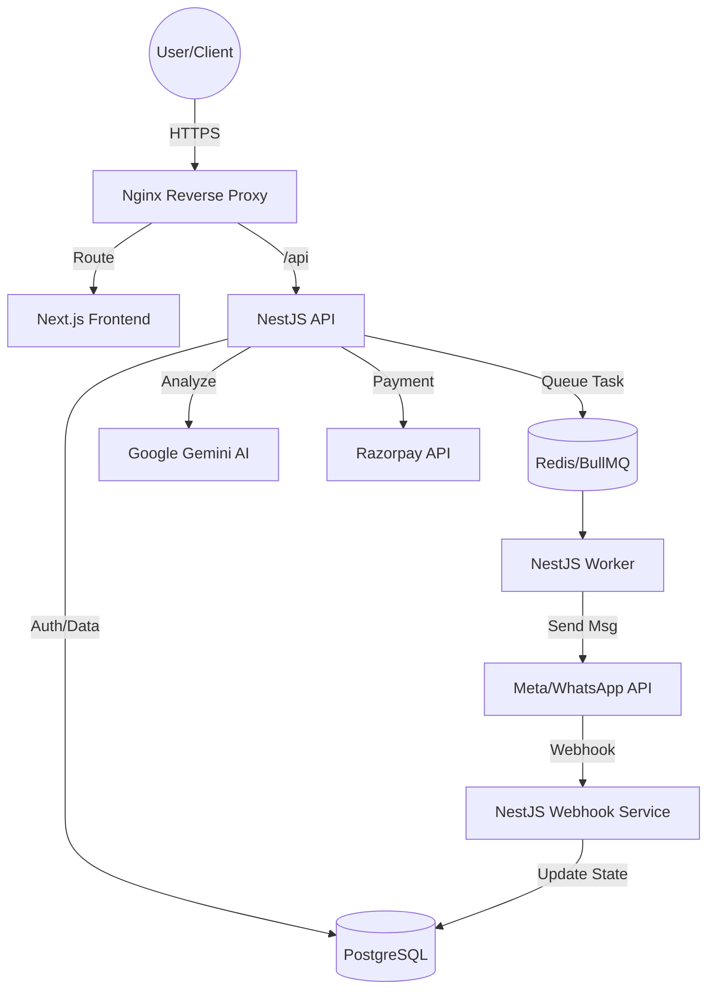

# Aerostic: Advanced Project Analysis & Blueprint

Aerostic is a sophisticated, multi-tenant WhatsApp Marketing & Automation Platform designed for businesses and resellers. It features a modern micro-monolith architecture with specialized services for handling high-volume messaging, AI integrations, and reseller management.

## 🏗️ System Architecture

### 🌐 1. Infrastructure Layer
The infrastructure is organized into a clean, hierarchical structure for deployment and operations.

- **Cloudflare**: DNS, SSL, and WAF configuration.
- **Nginx**: Production-grade proxy with specialized site configs for Landing, App, Admin, and API.
- **Docker**: Containerized services with specialized Dockerfiles and orchestrated via Docker Compose.
- **Monitoring**: Centralized logging, automated health checks, and backup management.
- **Deployment**: Automated EC2 setup scripts and environment templates.

### 🏠 2. Frontend Layer
```text
aerostic/
├── frontend/
│   ├── landing/                     # React + Vite
│   │   ├── pages/
│   │   ├── components/
│   │   └── build/
│   │
│   ├── app-dashboard/               # Next.js (Tenant App)
│   │   ├── app/
│   │   │   ├── dashboard/
│   │   │   ├── campaigns/
│   │   │   ├── automation/
│   │   │   ├── ai-agents/
│   │   │   ├── knowledge-base/
│   │   │   ├── inbox/
│   │   │   ├── billing/
│   │   │   └── settings/
│   │   │
│   │   ├── middleware.ts            # Host-based tenant resolution
│   │   ├── components/
│   │   └── utils/
│   │
│   └── admin-panel/                 # Next.js (Platform Admin)
│       ├── app/
│       │   ├── analytics/
│       │   ├── tenants/
│       │   ├── resellers/
│       │   ├── plans/
│       │   ├── revenue/
│       │   └── system-health/
│       │
│       └── components/
├── backend/                        # NestJS Micro-monolith
│   ├── api-service/                # Main REST API Service
│   │   ├── auth/                   # Authentication logic
│   │   ├── tenants/                # Multi-tenancy isolation
│   │   ├── users/                  # User management
│   │   ├── billing/                # Payments & Subscriptions
│   │   ├── reseller/               # Reseller hierarchy
│   │   ├── campaigns/              # WhatsApp Messaging campaigns
│   │   ├── automation/             # Workflow engine & triggers
│   │   ├── workflows/              # Visual flow builder logic
│   │   ├── ai/                     # Gemini AI integrations
│   │   ├── knowledge-base/         # RAG & Document storage
│   │   ├── analytics/              # Usage & Performance tracking
│   │   ├── api-keys/               # Developer API key management
│   │   └── admin/                  # Platform administration
│   │
│   ├── webhook-service/            # Meta/WhatsApp Webhook Handler
│   │   ├── whatsapp/               # Messaging events
│   │   └── inbound-processing/     # Message queueing & processing
│   │
│   ├── worker-service/             # Background Job Processors
│   │   ├── campaign-worker/        # Bulk messaging
│   │   ├── automation-worker/      # Flow execution
│   │   ├── ai-worker/              # Async AI processing
│   │   ├── usage-worker/           # Credit consumption tracking
│   │   └── metrics-worker/         # System metrics calculation
│   │
│   └── shared/                     # Reusable Modules & Utilities
│       ├── database/
│       │   ├── entities/       # Centralized TypeORM Entities
│       │   │   ├── core/       # tenants, users, domains, branding, api_keys
│       │   │   ├── billing/    # plans, subscriptions, wallet_tx, usage_events
│       │   │   ├── messaging/  # campaigns, recipients, messages, conversations
│       │   │   ├── automation/ # workflows, rules, executions
│       │   │   ├── ai/         # agents, knowledge_base
│       │   │   └── analytics/  # daily_metrics (Dashboard data source)
│       │   └── data-source.ts
│       ├── queue/                  # BullMQ shared config
│       │   ├── queue-names.ts      # campaign, automation, ai, webhook, usage, metrics
│       │   └── queue.module.ts     # Global BullMQ initialization
│       ├── security/               # 🛡️ Security Layer
│       │   ├── encryption.service.ts # AES-256 OAuth protection
│       │   ├── auth.guard.ts       # JWT + TokenVersion
│       │   ├── tenant.guard.ts     # Multi-tenant isolation
│       │   ├── roles.guard.ts      # RBAC enforcing
│       │   └── webhook.guard.ts    # Meta signature verification
│       ├── logger/                 # Custom shared logger
│       ├── guards/                 # Auth & Permissions guards
│       ├── middleware/             # Request interceptors
│       └── scheduler/              # Cron & Scheduled tasks
├── database/                       # Migrations & Seeds
├── infrastructure/                 # Docker & Nginx configs
└── docs_archive/                   # Historical documentation
```

## 🛠️ Technology Stack

| Layer | Technologies |
| :--- | :--- |
| **Frontend** | Next.js 15, Framer Motion, Tailwind CSS, Shadcn/UI, React 19 |
| **Backend** | NestJS (TypeScript), TypeORM, BullMQ, Socket.io |
| **Database** | PostgreSQL (Main), Redis (Cache & Queues) |
| **Mobile** | Capacitor (Android/iOS), React/Vite |
| **Integrations** | Meta Graph API (WhatsApp), Google Gemini (AI), Razorpay (Billing) |
| **Deployment** | Docker, Nginx, AWS EC2, GitHub Actions |

## 📊 System Flow Diagram



## 🔑 Core Pillars

### 1. Advanced Multi-Tenancy
The system uses a **Slug-based Tenant Isolation** strategy. Each tenant has isolated configurations, users, and WhatsApp accounts.
- **Tenant Entity**: Stores limits (messages, credits), plan details, and branding.
- **Strict Isolation**: `TenantGuard` enforced at the request level for all routes.

### 2. WhatsApp Integration (Meta v21.0)
Fully integrated with Meta's **Embedded Signup** flow and high-volume Messaging APIs.
- **Ledger-Based Billing**: Usage tracked via immutable `usage_events`, preventing credit race conditions.
- **Scale-Ready Queues**: Six dedicated BullMQ queues with exponential backoff and failover.

### 3. AI-Driven Automation
Aerostic leverages **Google Gemini** for:
- Contextual auto-replies and lead scoring.
- Sentiment analysis and automated RAG-based supportbot flows.
- High-level decision making in visual automation workflows.

## 🔄 Complete System Flows

### 1. Outgoing Campaign Flow
`Dashboard` → `API Service` → `campaign_queue` → `campaign-worker` → `Meta API` → `messages table` → `usage_events` → `metrics_queue` → `tenant_daily_metrics`

### 2. Inbound Message Flow (Automation & AI)
`Meta` → `webhook-service` → `webhook_queue` → `automation_queue` → `automation-worker` → `ai_queue (if needed)` → `ai-worker` → `Reply → Meta` → `Log → usage_events`

### 3. Analytics & Reporting Flow
`usage_events` → `usage-worker` → `tenant_daily_metrics` → `Dashboard`

---

## 🛡️ Security Architecture
- **JWT Isolation**: Tokens include `tenantId` and `tokenVersion`.
- **RBAC**: Multi-tier role-based access (Owner, Admin, Agent).
- **Encryption**: AES-256 for all external provider tokens.
- **Webhook Integrity**: HMAC-SHA256 signature verification.

---

## 📈 Scaling Roadmap

| Scale | Architecture | Components |
| :--- | :--- | :--- |
| **0–2K Users** | Single EC2 | Vertical scaling, single DB/Redis instance. |
| **2K–10K Users** | Distributed Workers | Read replicas, message partitioning, queue clustering. |
| **10K+ Users** | Microservices / Sharded | Full DB sharding, Redis clusters, dedicated VPCs for services. |
## 🚀 Deployment Strategy
The project is containerized using Docker, with a multi-service orchestration:
1. **API Service**: Main request handling.
2. **Worker Service**: Background jobs (campaigns, bulk sends).
3. **Webhook Service**: High-concurrency incoming HTTP requests from Meta.
4. **Postgres/Redis**: Data persistence and messaging backbone.

---
> [!NOTE]
> This blueprint is a living document and should be updated when major architectural changes are implemented (e.g., migrating to shared schemas or event-driven microservices).
